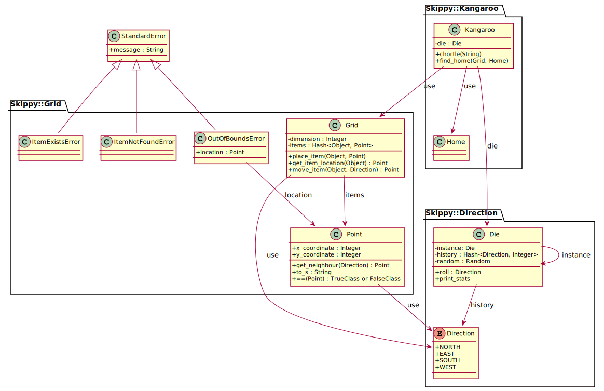

# will-skippy-get-home

[](https://github.com/jaaufauvre/will-skippy-get-home/actions?query=workflow%3AJava)
[](https://github.com/jaaufauvre/will-skippy-get-home/actions?query=workflow%3ARuby)

Will Skippy Get Home? 

## Overview
See [Part I: Basic Simulation](https://csserver.ucd.ie/~meloc/MScASE/resources/skippy.pdf)

## Compatibility
* Java 10+
* Ruby 2.7+

## Usage
### Java
* Run tests: `mvn test`
* Run the program: `mvn exec:java "-Dexec.mainClass=org.my_projects.skippy.Main"`

### Ruby
* Install dependencies: `./bin/setup`
* Run tests: `rake test`
* Run the program: `ruby ./bin/console`

### Sample Output
```
Enter dimension of the grid (>=1):
100
Oops, hit the boundary: (-1, 0)
Oops, hit the boundary: (-1, 0)
Hopped to: (1, 0)
Hopped to: (1, 1)
...
Hopped to: (97, 99)
Oops, hit the boundary: (97, 100)
Hopped to: (98, 99)
Hopped to: (98, 98)
Hopped to: (98, 99)
Oops, hit the boundary: (98, 100)
Hopped to: (99, 99)
Finished in 119044 hops!

Die statistics:
Total throws: 119044
North: 24.9% South: 25.1% East: 25.1% West: 25.0%
```

## Design Notes
* `Grid` is a container with items on it. It provides methods for updating item locations (`placeItem`, `moveItem`) and makes it impossible for items to exit the grid (`OutOfBoundsException`)
* Skippy is an instance of `Kangaroo`. He is responsible for finding his way back to home (`findHome`). `Kangaroo` encapsulates this strategy: kangaroos roll the die and hop around the grid, instead of someone else rolling the die and making them hop.
* `Die` is a Singleton: we only need one die and one type of die in this exercise
* `Die` records and prints the throw history and statistics
* The outputs of this program are because of Skippy chortling or the die being asked to print its statistics.

[](./uml/skippy-plantuml.svg)

## Read Also
* https://en.wikipedia.org/wiki/Markov_chain
